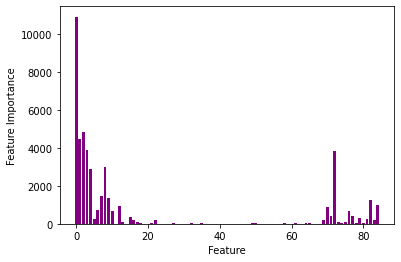

# Predicting Fatal Crash instances using the US Fars database (Fatal Analysis Reporting System)

## Overview

There were 33,244 fatal motor vehicle crashes in the United States in 2019 in which 36,096 deaths occurred. On average it costs $1200 to send each ambulance to a crash site. This project considers the factors which predict fatal instances of crashes so that emergency services may be distributed accordingly, decreasing the number of excess crash deaths while also minimising the cost of response vehicles.

## Libraries, technologies and tools

- Numpy
- Pandas
- SciPy - Stats 
- Matplotlib
- Seaborn
- Yellow Brick - DiscriminationThreshold
- SKlearn (SelectKBest / chi2 / train_test_split / mean_squared_error / cross_val_score / log_loss / StandardScalar / OrdinalEncoder / MinMaxScaler / LogisitcRegression / LogisticRegressionCV / KNeighborsClassifier / confusion_matrix / plot_confusion_matrix / plot_roc_curve / accuracy_score / precision_score / f1_score / classification_report / roc_auc_score / average_precision_score / plot_precision_recall_curve / DecisionTreeClassifier / AdaBoostClassifier / GradientBoostingClassifier / RandomForestClassifier / naive_bayes / CategoricalNB / MultinomialNB / ExtraTreesClassifier / BaggingClassifier / DecisionTreeClassifier / MLPClassifier / GridSearchCV / RandomizedSearchCV)

## Table of Contents

1. [Objectives](##Objectives)
2. [Background](##Background)
3. [Data Cleaning and Feature Engineering](##Data_Cleaning_and_Feature_Engineering)
4. [Exploratory Data Analysis](##Exploratory_Data_Analysis)
5. [Modelling](##Modelling)
6. [Evaluation](##Evaluation)
7. [Limitations](##Limitations)
8. [Conclusions and decision recommendations](##Conclusions_and_decision_recommendations)
9. [Further investigations](##Further_investigations)
10. [Key learnings](##Key_learnings)

## Objectives

* Predict (via classification) whether a person involved in a fatal crash will be a fatality above the baseline of 63%
* Investigate and highlight the most important factors of an accident, person and vehicle which contribute to fatalities in crashes in order to distribute emergency services effectively
* To consider the monetary impact of amending probability thresholds when predicting classification 

## Background

The FARS (fatal analysis reporting system) database collects information on every fatal crash across the United States. The data for this project considers crashes in 2019 comprising initially of 57882 persons, with each instance an amalgamation of three auxiliary data frames consisting of information on the person themselves, the vehicle they were travelling in and the overall accident. 

## Data Cleaning and Feature Engineering

The data itself was made up exclusively of categorical variables, which in itself presented some interesting problems for feature choice. As the data is only concerned with fatal crashes, single person crashes (such as a single person in a car colliding with a tree) were excluded from the data due to certainty of death, as this would give us an artificially increased prediction of fatality. Pedestrians involved in crashes were also removed, as these instances do not include most of the features the project is interested in such as vehicle type / licence status etc. 

| Variable            | Outcomes                                                                | 
| ------------------- |:-----------------------------------------------------------------------:|
| Blood Alcohol       | Not Tested, Tested and Positive, Tested and Negative                    |
| Ejected             | 0,1                                                                     |  
| Person Type         | Occupant, Driver                                                        |   
| Age                 | Range: 12.5 to 66.5                                                     |  
| Safety Measure      | 0,1                                                                     |  
| Vehicles in crash   | 1, 2, >2                                                                |  
| Day of Week         | Weekend, Weekday                                                        |  
| Time of Day         | Daytime, Nighttime                                                      |  
| Manner of Collision | Angle, head-on, sideswipe, not collision with motor vehicle in transport|  
| State               | 50 US States                                                            |  
| Vehicle Type        | Car, Light Truck, Motorcycle, Bus, Large Truck                          |  
| Impact Point        | Front, Left Side, Rear, Right Side, Non-Collision                       |  
| Licence Status      | Valid, Invalid                                                          |  
| Speeding            | 0,1                                                                     |  
| Rollover            | 0,1                                                                     |  
| Target: Fatality    | 0,1                                                                     |  

**Notes:**

**Binary variables:** All binary variables excluding fatality are coded as 0 being ‘No’ and 1 being ‘Yes’. The fatality variable is coded with 0 being ‘non-fatality’ and 1 being ‘fatality’.

**Age:** The age of the person within the original data is collected as a series of binary markers with each giving information about whether the person was in a specific age bracket. For the purposes of this project the age was imputed as the median value from the smallest inferred age range and used as a continuous variable. 

**Safety measure:** This is a join of several data columns and represents whether the person was using an appropriate safety device, i.e if the person was on a motorcycle whether they were wearing a helmet, if the person was in another type of vehicle whether they were using a seatbelt. 

**Licence status:** This variable indicates whether the person driving the vehicle held a valid licence for that vehicle (a valid car licence for a car or a valid motorcyle licence for a motorcyle).

## Exploratory Data Analysis

EDA was used to highlight trends across the data and give an indication of interesting features for further investigation. 

The graph above gives the first indication that motorcycle riders are at the highest risk of fatality, as this is the only vehicle where fatalities outnumber non-fatalities. Safer vehicles appear to be larger, i.e trucks and buses. 

As we can observe from the pie chart above only around 37% of those involved in a fatal car crash are given a blood alcohol test. This was the first instance in which the question of ‘when’ a blood alcohol test will be given by a police officer or paramedic, as the majority of those in the crashes are not given tests and of those that are the majority are negative. This question is addressed later in the project. 

The box plot above shows a similar distribution across the age ranges for using an appropriate safety measure (helmet or seatbelt), with the median value being slightly lower in the negative class, indicating that on average younger people are less likely to use a safety measure. Very concerning are the lower values on the negative class, indicating there were young children (around 12 years old) who were not wearing a seatbelt whilst being a passenger. 

The KDE histogram on the left shows the distribution of ages across all instances, we can see two significant peaks, one around 20 years old and one around 62 years old, showing that a large proportion of these crashes involve young people and older people. When we compare this against the distribution of fatalities we can see that a lower proportion of younger drivers are killed in these crashes than are involved, however a larger proportion of older drivers are killed in these crashes than are involved. This may indicate that age is a factor in determining fatality, with older people being more likely to be fatalities. 

**Feature Selection**

At this point a Chi-squared test for association was run for each feature against the target variable of fatality in order to decrease the number of features in the set to prevent overfitting of models. Every feature in the data set showed significant association with the target except for ‘Time of day’ and ‘Day of week’, hence these variables were removed for the remainder of the project. The largest bar on the very left of the diagram represents the age variable. Using an arbitrary cut off point the top 20 most associated features were chosen, these are shown below;

|                    |                    |                    |                    |
|--------------------|--------------------|--------------------|--------------------|
|Age                 |BAC - Not tested    |BAC - Negative.     |BAC - Positive      |
|Motorcyle           |No safety measure   |Ejected             |Occupant            |
|Safety Measure      |Speeding            |Rollover            |>2 Vehicles         |
|Large Truck         |Driver              |1 Vehicle           |Non-collision Impact|
|Rear impact         |Light Truck         |Non-collision Manner|Invalid Licence     |

## Modelling 

A wide selection of classification models were run on the full features data set and the reduced set of 20 identified by the test above. The mean cross-validated results for each model, along with their 95% confidence intervals, are shown in the diagram below. The baseline value for the data was 63% which is the proportion of the majority class (non-fatality). 

The two models chosen for further investigation were the ‘Gradient boosting classifier’ on the full dataset as the model with the highest overall scores and the ‘Logistic regression classifier’ on the full dataset as best ‘white-box’ model, giving us more detailed information on the individual features which contribute to each class in the target variable. 

**Note:** Near the completion of the project I learned and began to run NeuralNet algorithms and therefore utilised a feed forward multilayer perceptron algorithm on the full and reduced features set. The scores were very stable at 83% for the mean CV score (as well as for the test and training score) after tuning with a RandomizedSearch. These were impressive scores but not high enough to out compete the best black-box model. 

## Evaluation

**Model 1: Gradient boosting classifier (full features set) (accuracy: 86%)**

The confusion matrix above shows the accuracy of the model and is normalised according to the true label. We can see that the model performed well with an overall accuracy of 86% and was highly accurate across the majority class (non-fatality) with 91% being correctly classified as non-fatalities correctly and around 9% being mis-classified as fatalities when the person did not die. This 9% represents wasted resources in terms of emergency services as these are instances in which we likely would send emergency services when the person is not in danger of death, in monetary terms this represents around $3,922,668.

For those people in the minority class (fatality) the results are predictably less accurate with around 77% being correctly classified as fatalities. The most worrying figure output from this model is the false negative value of around 23%, this value represents those people who died but were predicted as being non-fatalities, therefore each person within this category represents a life that can possibly be saved. For the purposes of this project this is an unacceptable loss of life and therefore measures to reduce this figure are detailed below. 

It is important for the project to address the problem of false negatives. In order to decrease this value of 23% a threshold plot was used to find an optimum probability threshold to classify the target. This probability value of 40% represents the value that decreases fatalities misclassified as non-fatalities while also considering the monetary value of unnecessary use of emergency services (false positives). 

The new values for this amended probability threshold were (normalised across the True Labels):

* True positives: 87%
* False positives: 17%
* False negatives: 13%
* True negatives: 83% 

As we can see the number of mis-classified fatalities has decreased from 23% to 13%, representing a real-world decrease of 2156 people, each of which is a possible saved life. The counter balance to this is that our false positive rate has increased from 9% to 17%, representing an extra $3,486,816 in emergency resources. 

**Model 2: Logistic regression classifier (full features set) (accuracy: 82%)**

Although the logistic regression classifier gives an overall lower accuracy score it gives us more information about the strength of each feature and which class they predict for. Most of these feature importances are intuitive, for non-fatalities we can see that being in a large vehicle such as a bus or truck decreases the risk of death, as identified by previous EDA. Using a safety measure and not being ejected from the vehicle also decreases the risk of death. 

When considering features which indicate fatalities we can see that driving a motorcycle is of the largest importance, again this was identified with the EDA. Other features which increase the risk of death are not using a safety measure, being in a head-on or left-side collision and being ejected from the vehicle. 
The strangest outcome when looking at these features is that having a blood alcohol test, regardless of whether this comes out as being positive or negative, suggests a higher risk of death, whereas not having a blood alcohol test is a feature of non-fatalities. This outcome does feel counterintuitive and possible reasons for this are detailed in the further investigations section below. 

## Limitations

* **Class imbalance:** There was a larger majority of non-fatalities than fatalities, meaning the model tends to lean towards the majority class, which is not our area of investigation. SMOTE methods or undersampling could be utilised to combat this. 

* **Categorical variables:** The exclusive recording of categorical variables made feature selection more difficult as a heat-map could not be produced to show the strength of the relationship between the features and the target, or between the features themselves to check for collinearity. More data including continuous variables could be collected to enrich the data.  

## Conclusions and decision recommendations

* Motorcycles are the most dangerous form of transport, consider educational material to highlight the dangers to those getting a motorcycle licence and send emergency services to motorcycle crash sites. 

* Further encourage the use of safety measures for vehicles, perhaps through educational materials. 

## Further investigations

* When we ran the Chi-squared tests for predictor strengths the age variable came 2-3 times larger than any other predictor, suggesting this would be a good indicator for the fatal target; this was also suggested by the EDA. However, when we looked at the top 15 coefficients for the Logistic Regression Model ‘age’ did not appear at all, how might we explain this? It is possible that the signal for age is encoded within another feature, such as motorcycle use; more investigation is required to determine whether this is the case. 

* Blood alcohol being tested and coming out positive or negative comes up consistently as an indicator for death. Blood alcohol not being tested consistently comes up as an indicator for life. This begs the question, why and when do police or paramedics give blood alcohol tests? Presumably when the person is intoxicated, even if their BAC comes out negative they may be on another substance that is impairing their ability to drive. When I manually checked several of these results, conclusions were mixed. In one instance the driver was under the influence of amphetamines and methamphetamines, in another there was no evidence of impairment. Next step would be to exchange the BAC column for an under the influence column. This data is made available by the FARS database. A second possible reason for this is that a blood alcohol test may be ordered when the person appears to be confused or disoriented, which may be an indicator for head trauma and therefore is a predictor for later fatality. Currently no data is available to investigate this possibility. 

## Key learnings

**Choosing features using categorical variables:** Before the capstone project I was used to working with data that was mostly continuous and therefore would have used the Pearson's correlation coefficient within a heat-map to identify those features with the highest correlation to the target variable (or the Spearman's rank coefficient, depending on the distribution of the variables). It is likely I also would have used this method to check for collinearity between the features themselves. However, the fatal crashes data was made up exclusively of categorical variables, even the age variable which I had imputed and used as a continuous value originally came from a set of binary variables. It was important to identify which features had an effect on the target, hence the question, how do I perform feature selection on categorical variables? After researching I knew there were several tools which I might use: Chi-squared tests, the mutual information statistic or convert to a numerical value and use one-hot-coding. As a statistics teacher I had prior understanding of the Chi-squared distribution and so felt this was the best choice, which allowed me to slightly reduce the number of features by identifying those which were independent from the target (in this case ‘time of day’ and ‘time of week’). All other non-dummified features did not show independence from the target and hence were included. In addition to this I also ran a KBest algorithm using a Chi-squared measure on the dummified features (with an ordinal encoder) and chose the top 20 features identified by this process to use within later models. However, in the end the best models performed with the full features set. 

**Data visualisations with categorical variables:** Informative and aesthetically pleasing diagrams are an important part of communicating results and methodology in data science, however this process proved difficult with a set of categorical variables. Barring traditional proportion based visualisations, like the bar chart and pie chart, I did not come across many interesting ways to display the data. In part this is what prompted me to construct a quasi-continuous age variable, as displaying categorical variables in tandem with a continuous variable allows for a wider and more interesting range of visualisations. 

**Utilising data scalars:** I was already aware of the need to scale / standardise variables in order to perform statistical calculations and use some machine learning models, the StandardScaler being the method I had used the most frequently. However, during my project I came across several other scalars that were required to pre-process the data in order for particular algorithms to be used. For example I used the OrdinalEncoder as a way to numerise the categorical variables in my dataset to be able to use the Kbest algorithm. I also used the MinMaxScaler within my model selection stage for the Bayes algorithms, as these cannot process negative numbers and hence the StandardScaler would not have been suitable. 

**Tuning hyperparameters:** It did not take long for my grid searches to reach the limit of my home computers processing capability, despite my new Mac computer with an M1 chip, which was not expected. Although I was keen to ensure I had managed to identify the optimum hyperparameters for each model, some algorithms (such as the boosted gradient classifier, which was my model with highest accuracy) took a very long time to gridsearch. One fateful weekend I attempted to run a large gridsearch with cross-validation with a total of 5,000,000 folds. To my disappointment, even after 65 hours processing time using all the cores of my computer, this did not produce results. On Monday morning I needed to use my computer for other activities, as I was on a course, so had to give up on this attempt, I knew that given the time constraints of the course I would not be able to allow this model to run to capacity. Still keen to tune the hyperparameters as close to optimum as possible I researched and ran some RandomizedSearch CV models, which increased the accuracy of my models in a significantly reduced timeframe. I intend to write a medium article about this in the hopes other people like myself who run into the same issues can also use the random search. After learning more I now realise I could have remotely run the full gridsearch using distributed cloud computing, possible through AWS, in order to ensure an optimum solution. 

